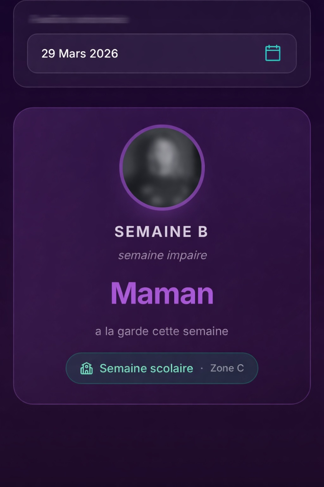
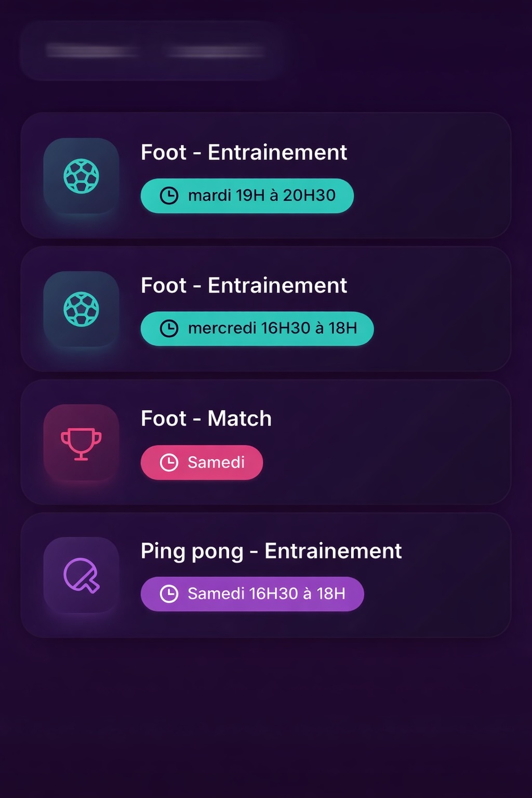

# Calendar du Duck

> A modern co-parenting organization app built for real life. Shared custody, simplified.

**Calendar du Duck** helps co-parents stay organized with a beautiful, mobile-first PWA for managing alternating custody weeks, kids' activities, school schedules, and handoff checklists.

Built as a real-world solution to a real-world problem: coordinating two households around the same kids.

---

## Screenshots

<p align="center">
  
  &nbsp;&nbsp;&nbsp;
  
</p>

<p align="center">
  <em>Custody calculator &mdash; who has the kids this week?</em>
  &nbsp;&nbsp;&nbsp;&nbsp;&nbsp;&nbsp;&nbsp;&nbsp;
  <em>Activities tracker with glassmorphism cards</em>
</p>

---

## Features

| Feature | Description |
|---------|-------------|
| **Custody Calendar** | Instantly see which parent has custody this week based on even/odd ISO week numbers |
| **Activities Tracker** | Each child's extracurricular schedule (training, matches, etc.) in dedicated tabs |
| **School Planning** | Zoomable school schedule images per child |
| **Handoff Checklist** | Interactive todo list for parent-to-parent transitions (gear, clothes, school items) |
| **Arrival Times** | Quick-reference table for school period start times |
| **School Holidays** | Automatic school vacation indicator (Zone C) |
| **PWA** | Installable on iOS/Android with offline support and native-feel navigation |

## Tech Stack

| Layer | Technology |
|-------|-----------|
| Framework | [Next.js 16](https://nextjs.org) (App Router) |
| Language | TypeScript (strict mode, zero `any`, zero `as` casts) |
| Styling | Tailwind CSS + CSS custom properties |
| UI | [shadcn/ui](https://ui.shadcn.com) + [Radix](https://radix-ui.com) primitives |
| Icons | [Lucide React](https://lucide.dev) + [Phosphor Icons](https://phosphoricons.com) |
| i18n | [next-intl](https://next-intl-docs.vercel.app) |
| Forms | React Hook Form + Zod validation |
| PWA | [@ducanh2912/next-pwa](https://github.com/AugusDogaworkerh2912/next-pwa) |

## Design

- **Disney+ inspired** dark purple theme with glassmorphism effects
- Deep purple gradient background (`hsl(270 89% 8%)`)
- Teal & purple dual-accent system for parent differentiation
- Glass morphism navigation bars and cards
- Fully responsive: mobile-first with desktop adaptation

## Getting Started

```bash
git clone https://github.com/decuyperanthony/calendar-du-duck.git
cd calendar-du-duck

pnpm install

# (Optional) Personalize with your family's names and images
cp .env.example .env.local
# Edit .env.local with your own values

pnpm dev
```

Open [http://localhost:3000](http://localhost:3000) to view the app.

## Personalization

The app ships with generic labels and placeholder avatars. To customize for your family, create a `.env.local` file:

```env
# Family names
NEXT_PUBLIC_PARENT_A_NAME=Papa
NEXT_PUBLIC_PARENT_B_NAME=Maman
NEXT_PUBLIC_CHILD_A_NAME=Alice
NEXT_PUBLIC_CHILD_B_NAME=Hugo

# Custom images (local paths or external URLs)
NEXT_PUBLIC_IMAGE_PARENT_A=/images/parent-a.jpg
NEXT_PUBLIC_IMAGE_PARENT_B=/images/parent-b.jpg
NEXT_PUBLIC_IMAGE_PLANNING_CHILD_A=/images/planning-child-a.jpg
NEXT_PUBLIC_IMAGE_PLANNING_CHILD_B=/images/planning-child-b.jpg
```

All names and images are loaded from environment variables at build time — no database needed.

## Architecture

```
app/
├── semaines/          # Custody week calculator (ISO week parity logic)
├── activites/         # Per-child activity schedules with tab navigation
├── passation/         # Handoff checklist (IndexedDB persistence)
├── planning/          # Zoomable school schedule images
├── heure-arrivee/     # School arrival times reference
└── layout.tsx         # Root layout: i18n provider, PWA setup, navigation

components/
├── common/            # Domain components (CustodyHero, ActivityCard, Menu)
└── ui/                # Design system (shadcn/ui: Card, Badge, Tabs, GlassBar)

lib/
├── family-config.ts   # Env-based family name configuration
├── utils.ts           # Tailwind merge + clsx utility
└── next-intl.ts       # Typed i18n hooks

assets/
└── image.ts           # Image registry with env var overrides

translations/
└── fr.json            # All UI strings (French)
```

### Key Design Decisions

- **ISO week parity** for custody: even weeks = Parent A, odd weeks = Parent B. Simple, deterministic, no backend needed.
- **Env-based personalization**: all names and images configurable via environment variables, making the app reusable for any family.
- **PWA-first**: installable on iOS/Android home screens with native splash screens and offline capability.
- **CSS custom properties** for theming: all colors are tokens, making theme changes a single-file edit.
- **Strict TypeScript**: zero `any`, no `as` casts, Zod for runtime validation at boundaries.
- **i18n from day one**: all strings externalized via next-intl.

## Scripts

```bash
pnpm dev               # Development server
pnpm build             # Production build
pnpm start             # Production server
pnpm lint              # ESLint
pnpm generate:icons    # Generate PWA icons from SVG
pnpm generate:splash   # Generate iOS splash screens
pnpm generate:pwa      # Generate all PWA assets
```

## License

MIT
